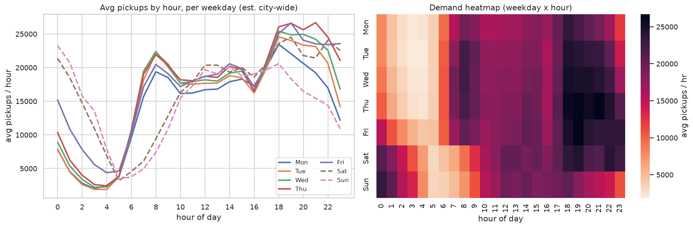
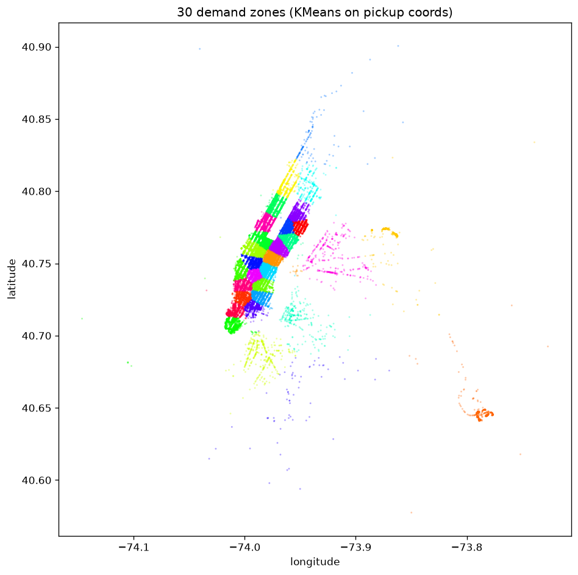
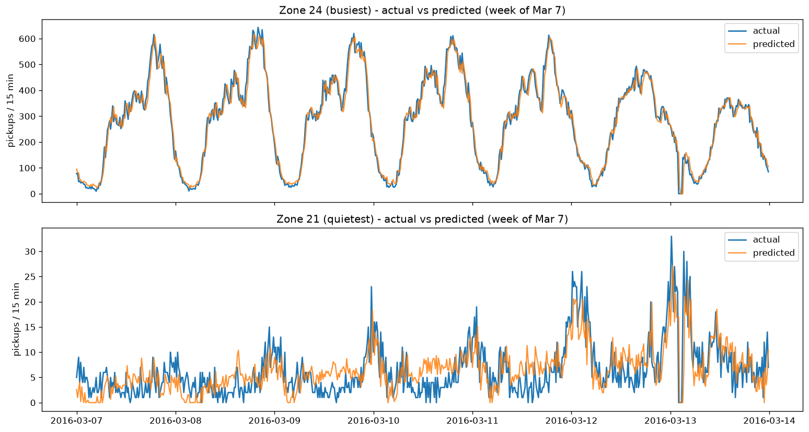

# 🚕 NYC Taxi Demand Prediction

Predict the number of taxi pickups in each of **30 NYC zones** for the **next 15 minutes**, from
NYC Yellow-Taxi trip data (2016, Jan–Mar). A supervised **regression** problem built on a
**time-series + spatial-clustering** pipeline, served as an interactive **Streamlit** app.

**🚀 Live demo:** _add your Streamlit Cloud URL here after deploying_ · **Stack:** Python 3.12 · Dask · scikit-learn · MLflow · DVC · Streamlit

---

## The problem

> *"Given the recent pickup counts in a NYC zone, how many taxi pickups will happen there in the
> next 15 minutes?"* — answered for 30 zones across the city, so drivers/dispatchers know where
> demand is about to be.

**Pipeline (one command rebuilds it all with `dvc repro`):**

```
raw trips (34.5M rows, ~7 GB)
   → clean          (drop bad GPS + impossible fares/distances → 33.8M)
   → cluster        (MiniBatchKMeans → 30 demand zones)
   → time series    (count pickups per zone per 15-min slot)
   → features       (lags + cyclical time encodings)
   → train + eval   (baselines vs models, MLflow-tracked)
   → Streamlit app
```

## Results (March 2016 hold-out test)

| Model | MAE | RMSE | MAPE·(non-zero) |
|---|---|---|---|
| **Random Forest** | **13.87** | **21.50** | 20.4% |
| **Linear Regression** *(deployed default)* | 14.86 | 22.58 | 24.3% |
| Ridge | 15.06 | 22.95 | 26.2% |
| Baseline — *predict last value* | 15.62 | 23.80 | 22.5% |
| Baseline — *predict EWMA* | 19.41 | 29.31 | 29.1% |

**Both models beat the naive baselines on MAE and RMSE** — and that bar is *hard*, because
`lag_1` (last value) already correlates 0.98 with the target. The app lets you toggle between the
interpretable Linear model and the more-accurate Random Forest.

> **Why report MAE/RMSE and not MAPE?** In our own numbers, Linear Regression's MAPE is *worse*
> than the baseline's while its MAE is *better* — MAPE explodes near zero demand and is misleading
> here. (The reference project hid this by faking zero counts to 10; we don't.)

## What the data shows

**Demand is cyclical in time** — twin weekday rush peaks, a weekend late-night shift:



**Demand is concentrated in space** — Manhattan + the airports — which is why we model 30 zones,
not one city-wide number:



**The model tracks reality** — predicted vs actual for the busiest and quietest zone:



## Three improvements over a typical version of this project

1. **Hour-of-day + cyclical (sin/cos) time features** — the strongest signal (see the chart above),
   which the reference project ignored. Cyclical so 23:00 and 00:00 are neighbours, not 23 apart.
2. **Naive baselines** ("predict last value" / EWMA) — so the model's value is *proven*, not assumed.
3. **Honest metrics** — MAE/RMSE + error analysis, and **true zero counts kept** (no zero→10 hack
   that corrupts the target to flatter MAPE).

## Reproduce it

```bash
# 1. environment (Python 3.11 / 3.12)
python3.12 -m venv .venv && source .venv/bin/activate
pip install -r requirements-dev.txt          # full pipeline + notebooks

# 2. point at the raw CSVs (kept OUT of git; ~7 GB) in params.yaml -> paths.raw_data_dir

# 3. rebuild the whole pipeline from raw data
dvc repro                                     # data_ingestion → … → evaluate

# 4. inspect experiments
MLFLOW_ALLOW_FILE_STORE=true mlflow ui --backend-store-uri ./mlruns   # http://127.0.0.1:5000

# 5. run the app
streamlit run app.py
```

`requirements.txt` is the **minimal, pinned** runtime subset that Streamlit Community Cloud installs;
`requirements-dev.txt` adds Dask, MLflow, DVC and Jupyter for the pipeline.

## Repository layout

```
data/            raw, interim (gitignored) · processed, external (small committed artifacts)
src/data/        data_ingestion.py          — clean the raw CSVs (Dask, out-of-core)
src/features/    make_regions.py            — KMeans zones + 15-min time series
                 build_features.py          — lags + cyclical features + time split
src/models/      train.py / evaluate.py     — baselines, models, MLflow, metrics
                 common.py / serving.py      — shared pipeline + app serving logic
notebooks/       01_eda.ipynb · 02_modeling.ipynb
models/          scaler, kmeans, model_linear_regression, model_random_forest (joblib)
reports/         metrics.json · figures/
app.py           Streamlit demo          ·  dvc.yaml / params.yaml — pipeline + config
docs/            interview_prep.md
```

## Notes & limitations

- Errors concentrate in **high-demand evening hours** and a few **bursty, airport-style zones** —
  a sensible next step is per-zone or airport-specific handling.
- Deliberately **not** using deep learning, streaming, or a heavy cloud MLOps stack: a simple,
  explainable model wins on this problem and is defensible end-to-end.

_Data: [NYC TLC Trip Record Data](https://www.nyc.gov/site/tlc/about/tlc-trip-record-data.page)._
