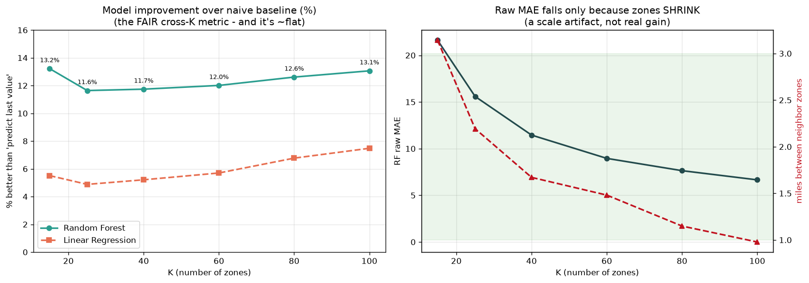

# Interview Prep — NYC Taxi Demand Prediction

Everything you need to defend this project line-by-line. Real numbers from *your* run are baked in.

## 30-second pitch

> "I built a system that predicts taxi demand for the next 15 minutes across 30 NYC zones. I
> cleaned 34 million trips out-of-core with Dask, clustered pickups into 30 zones with KMeans,
> turned that into a per-zone 15-minute time series, and trained regression models with lag and
> cyclical-time features. The key discipline was proving the model beats naive baselines using
> honest metrics (MAE/RMSE, not MAPE), avoiding data leakage with a time-based split, and shipping
> it as a Streamlit app you can try. I deployed both an interpretable Linear model and a more
> accurate Random Forest so you can see the accuracy-vs-explainability trade-off."

## Key numbers to remember

| Thing | Value |
|---|---|
| Raw trips → clean | 34.5M → 33.8M (2.1% dropped) |
| Zones (K) | 30, avg 1.94 mi between neighbouring centres |
| Time series | 262,080 rows (30 zones × 8,736 fifteen-min slots) |
| Split | Jan+Feb train (172,680) / March test (89,280) |
| `lag_1` ↔ target correlation | 0.98 |
| Best model (RF) MAE / RMSE | 13.87 / 21.50 |
| Deployed LR MAE / RMSE | 14.86 / 22.58 |
| Best baseline (last value) MAE | 15.62 |

---

## Concept cheat-sheet

- **KMeans clustering** — unsupervised: feed pickup lat/long, it finds 30 centres and labels each
  trip by its nearest centre = its zone. Scale coordinates first (StandardScaler) so lat and long
  are comparable before distances are measured.
- **Choosing K=30** — not a guess: after fitting, each zone's 8 nearest neighbour-centres average
  **1.94 miles** apart (haversine = true earth-surface distance) — roughly neighbourhood-sized.
- **Time series / resampling** — index data by time, bucket into fixed **15-minute** slots, count
  pickups per zone per slot → that count is the prediction **target**.
- **Lag features** — the inputs are previous slots' demand: `lag_1` = 15 min ago … `lag_4` = 60 min
  ago. That's how a regression "forecasts": next demand ≈ f(recent demand).
- **Data leakage & the shift** — never let a feature see the value it's predicting. The EWMA
  `avg_pickups` is **shifted by 1** so at slot *t* it only uses slots before *t*. Leakage = great
  test scores that collapse in production.
- **Time-based split (no shuffle)** — train on Jan+Feb, test on March. Shuffling a time series would
  leak the future into training.
- **Encoding** — `region` is **one-hot** (categorical, no order). `hour`/`day_of_week` are
  **cyclical (sin/cos)** so 23:00 sits next to 00:00 (a linear model can't learn that from the raw
  integer 23 vs 0).
- **Metrics** — **MAE** = average absolute error (interpretable: "off by ~15 pickups"). **RMSE**
  squares errors first, punishing big misses. **MAPE** = percentage error; it divides by the actual
  value so it **blows up near zero demand** — unreliable here.
- **Baseline** — the dumb model you must beat ("predict = last value"). Beating it is the whole point.
- **Dask** — a parallel/out-of-core version of pandas: processes the 34M rows in ~64 MB chunks so it
  never needs all the data in RAM at once.
- **MLflow** — a local experiment logbook (`mlruns/` folder): logs each model's params + metrics so
  runs are comparable. No cloud.
- **DVC** — "git for pipelines": `dvc.yaml` wires the stages so `dvc repro` rebuilds everything from
  raw data, skipping steps whose inputs haven't changed.

---

## Likely questions & strong answers

**Q. Walk me through the project.**
Raw CSVs → clean with Dask (drop bad GPS via a NYC bounding box + impossible fares/distances) →
KMeans into 30 zones → count pickups per zone per 15 min → add lag + cyclical-time features → split
by month → train baselines + models → evaluate on March → serve with Streamlit. One `dvc repro`
rebuilds it all.

**Q. What is one row / the target?**
One row = one zone in one 15-minute slot. The target is `total_pickups` in that slot. Features are
that zone's recent demand (lags, EWMA) and cyclical time-of-day / day-of-week.

**Q. How did you choose 30 zones?**
I didn't pick a round number — I checked the geometry. With K=30, each zone-centre's 8 nearest
neighbours are ~1.94 miles apart (haversine): fine-grained in dense Manhattan, coarser in the outer
boroughs. KMeans even discovered JFK and LaGuardia as their own zones.

**Q. How does a regression "forecast" the future?**
Through lag features. The model learns a function from the last four intervals' demand (plus time
context) to the next interval's demand. `lag_1` alone correlates 0.98 with the target.

**Q. How did you avoid data leakage?**
Two ways. (1) A **time-based split** — train on Jan+Feb, test on March, never shuffled. (2) The EWMA
feature is **shifted by one interval** so no row sees its own or any future value. I verified the
first slot of every zone is NaN (no history) and dropped it.
*Subtle point:* lags are computed on the full series **before** splitting, so the first March rows
use late-February demand — that's legitimate (it's in the past), not leakage.

**Q. Why cyclical (sin/cos) encoding for time?**
Because time is circular. As a raw integer, hour 23 and hour 0 look 23 apart, but they're 1 hour
apart. Mapping hour onto a sin/cos circle makes 23:00 and 00:00 neighbours, which a linear model can
actually use. This was the single biggest signal in the EDA and the main upgrade over the reference.

**Q. Why MAE/RMSE instead of MAPE?**
MAPE divides by the actual value, so on low-demand slots (near zero) it explodes and dominates the
average. In my results the Linear model's MAPE (24%) is *worse* than the baseline's (22.5%) even
though its MAE is clearly *better* — a direct demonstration that MAPE is misleading here. The
reference project dodged this by replacing zero counts with 10, which corrupts the target; I kept
true zeros and reported MAE/RMSE.

**Q. Why bother with baselines? Your model only beats "last value" by ~5% on MAE.**
The baseline is how you *prove* the model adds value — without it, a good-looking MAE means nothing.
And ~5% is meaningful here precisely because the baseline is so strong (0.98 correlation): the model
earns its keep during transitions — rush-hour ramps and demand turning points — where "just repeat
the last value" lags reality. On RMSE (which punishes big misses) the gap is larger.

**Q. Why deploy Linear Regression when Random Forest scored better?**
Deliberate trade-off. Random Forest is ~7% better on MAE (13.87 vs 14.86) but it's a black box; the
Linear model I can fully explain — I can read its coefficients (`lag_1` dominates, cyclical terms
nudge by time-of-day) and defend every prediction. For a demand model I'd want to reason about,
interpretability is worth more than a few percent. I deployed **both** and let the app switch, so
the trade-off is visible, not just asserted.

**Q. Why not deep learning (LSTM/Transformer)?**
It adds complexity and training cost without beating a simple, explainable model on this problem —
lag + time features already capture the structure. I prioritised a solution I fully understand and
can defend. If demand had long, non-linear temporal dependencies I couldn't capture, I'd revisit.

**Q. How does this scale to bigger data?**
The heavy steps are out-of-core: Dask reads and filters the 34M rows in chunks (never all in RAM),
and I fit KMeans on a representative 2M-point sample then assign all 34M trips in Dask partitions.
MiniBatchKMeans also supports streaming `partial_fit` if the sample itself didn't fit in memory.

**Q. What are DVC and MLflow doing for you?**
DVC makes the pipeline **reproducible** — `dvc repro` rebuilds every artifact from the raw CSVs in
dependency order and skips stages whose inputs are unchanged. MLflow is the **experiment logbook** —
every model + baseline is a run with logged metrics, so the comparison is auditable. Both are local;
no cloud, by design.

**Q. Where does the model fail?**
Error concentrates in **high-demand evening/late-night hours** and a few **bursty, airport-style
zones** (the hardest zone had ~2× the average error). On very quiet zones the model captures the
trend but smooths over noisy spikes. Predicted-vs-actual and MAE-by-hour/zone charts show this.

**Q. What would you improve with more time?**
Special handling for airport zones (flight-schedule features), weather features (the Jan 23 blizzard
is a visible outlier day), quantile predictions for uncertainty, and a couple of pytest checks +
light CI so "model still beats baseline" is enforced automatically.

**Q. How would you make it real-time?**
This is a batch/offline project on historical data. For real-time I'd stream recent pickup counts,
recompute lags per zone on a rolling window, and serve the same model behind an API — the feature
logic is identical; only the data source changes.

---

## Deep dive: how I chose K=30 (and a metric trap to avoid)

I didn't just pick 30 and hope. I ran a full **K sweep** (K = 15, 25, 40, 60, 80, 100), training
**both** deployed models (Linear Regression + Random Forest) end-to-end at each K, with two
reasonableness gates decided up front: neighbour distance ~1–3 miles, and <5% zero-demand slots.

| K | zone size | RF improvement over baseline | note |
|---|---|---|---|
| 15 | 3.14 mi | +13.2% | too coarse (multi-neighbourhood zones) |
| 25 | 2.19 mi | +11.6% | |
| **30** | **~2.0 mi** | **~+11.2%** | **chosen** |
| 40 | 1.67 mi | +11.7% | |
| 60 | 1.48 mi | +12.0% | |
| 80 | 1.15 mi | +12.6% | |
| 100 | 0.98 mi | +13.1% | below 1-mile floor; 3× bigger model, ~26× slower to train |

**The trap (and the key insight):** *raw* MAE falls steadily as K rises (21.6 → 6.7) — but that is a
**scale artifact**, not a real gain: smaller zones have smaller pickup counts, so errors are smaller
numbers. The fair metric is **improvement over the naive baseline**, and on that metric the model is
**~flat (11.6–13.2% for RF) across every K** — it beats naive forecasting by ~12% whether there are
15 zones or 100. So K does *not* meaningfully change model quality.

**Conclusion:** since accuracy is flat, K is chosen on **interpretability + deployment cost**, where
K=30 wins — ~2-mile neighbourhood-sized zones a dispatcher can act on, a small/fast model, vs K=100's
sub-mile fragments and a much heavier model for no real accuracy gain.

**One-liner:** *"I swept K with both models. Raw error drops with K, but that's a scale illusion —
on the fair 'improvement over baseline' metric the model is flat at ~12% for all K, so I chose K=30
for interpretability and deployment cost, not to chase a smaller-but-meaningless MAE."*
